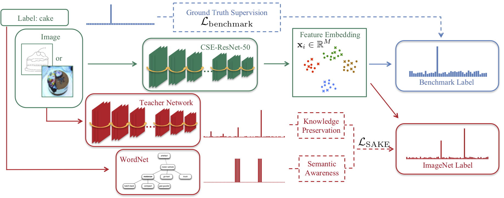

# Semantic-Aware Knowledge Preservation for Zero-Shot Sketch-Based Image Retrieval

This project is our implementation of Semantic-Aware Knowledge prEservation (SAKE) for zero-shot sketch-based image retrieval.
More detailed descriptions and experimental results could be found in the [paper](https://openaccess.thecvf.com/content_ICCV_2019/papers/Liu_Semantic-Aware_Knowledge_Preservation_for_Zero-Shot_Sketch-Based_Image_Retrieval_ICCV_2019_paper.pdf).


If you find this project helpful, please consider citing our paper.
```
@inproceedings{liu2019semantic,
  title={Semantic-aware knowledge preservation for zero-shot sketch-based image retrieval},
  author={Liu, Qing and Xie, Lingxi and Wang, Huiyu and Yuille, Alan L},
  booktitle={Proceedings of the IEEE/CVF International Conference on Computer Vision},
  pages={3662--3671},
  year={2019}
}
```
## Dataset
Download the resized TUBerlin Ext and Sketchy Ext dataset and our zeroshot train/test split files from [here](https://cs.jhu.edu/~qliu24/ZSSBIR/dataset.zip).
Put the unzipped folder to the same directory of this project.
## Training
CSE-ResNet50 model with 64-d features on TUBerlin Ext:
```
python train_cse_resnet_tuberlin_ext.py
```
CSE-ResNet50 model with 64-d features on Sketchy Ext:
```
python train_cse_resnet_sketchy_ext.py
```
## Testing
CSE-ResNet50 model with 64-d features on TUBerlin Ext:
```
python test_cse_resnet_tuberlin_zeroshot.py
```
CSE-ResNet50 model with 64-d features on Sketchy Ext:
```
python test_cse_resnet_sketchy_zeroshot.py
```
## Pre-trained model
Our trained models and extracted zeroshot testing features can be downloaded from [here](https://cs.jhu.edu/~qliu24/ZSSBIR/cse_resnet50.zip).
